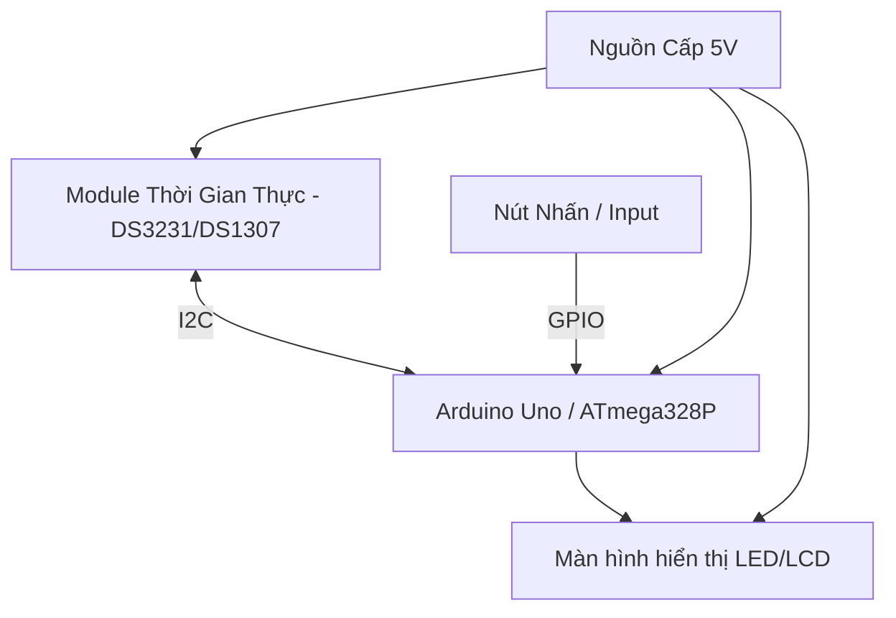
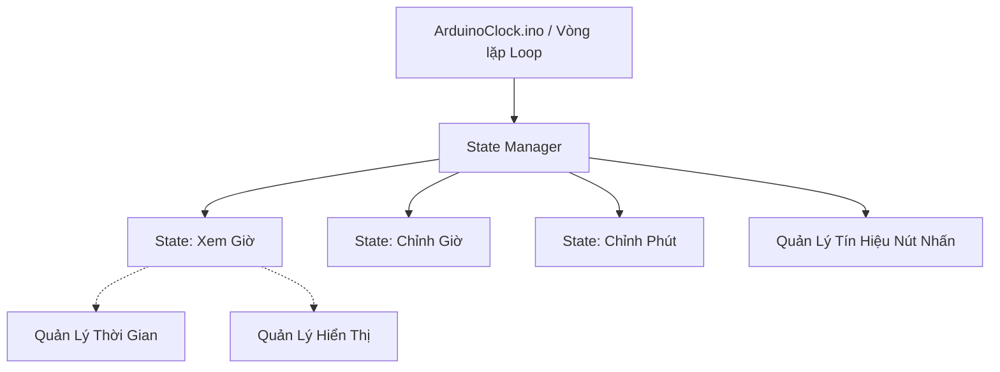
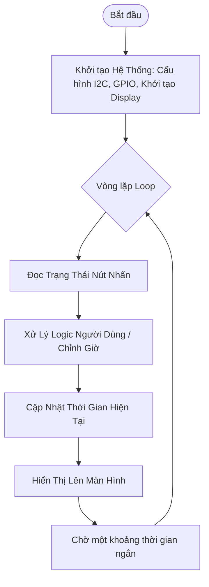

# Tài Liệu Kiến Trúc: AVR Clock (Arduino Uno)

## 1. Tổng Quan Hệ Thống (System Overview)
Hệ thống là một đồng hồ số (Digital Clock) chạy trên nền tảng vi điều khiển AVR (cụ thể là board Arduino Uno). Mục đích chính của dự án là thiết kế một hệ thống quản lý và hiển thị thời gian linh hoạt, tin cậy.

## 2. Kiến Trúc Phần Cứng (Hardware Architecture)

## 3. Kiến Trúc Phần Mềm (Software Architecture)
Mã nguồn được thiết kế theo hướng mô-đun hóa (Modular Design) kết hợp với State Pattern thông qua một **State Manager**. Thiết kế này nhằm tách biệt giữa logic nghiệp vụ (quản lý trạng thái) và phần cứng điều khiển.

Đặc điểm thiết kế State Manager:
- Sử dụng State Pattern để quản lý các trạng thái của đồng hồ (ví dụ: Xem giờ, Chỉnh giờ, Chỉnh phút).
- Lớp **Base State** sẽ có một thuộc tính **manager tĩnh (static manager)** thay vì phải truyền con trỏ manager qua tham số của hàm khởi tạo (constructor). Điều này giúp tiết kiệm bộ nhớ và tối ưu hiệu suất cho vi điều khiển.

## 4. Các Thành Phần Chính
1. **State Manager & Các State:** Điều phối luồng hoạt động chính của người dùng dựa trên State Pattern. Chuyển đổi giữa các trạng thái linh hoạt.
2. **Module Quản lý thời gian (Time Manager):** Giao tiếp với IC RTC để đọc/ghi thông tin thời gian thực. Duy trì biến đếm thời gian nội bộ, cập nhật theo giây.
3. **Module Quản lý hiển thị (Display Manager):** Chịu trách nhiệm render dữ liệu từ Time Manager ra màn hình. Được thiết kế để dễ dàng thay đổi loại màn hình (LCD 16x2, TM1637, MAX7219, v.v.).
4. **Module Quản lý nút nhấn (Input/UI Manager):** Xử lý tín hiệu nút nhấn vật lý, tích hợp thuật toán chống dội phím (debouncing) để hỗ trợ thao tác chuyển state trong State Manager.

## 5. Quy Trình Hoạt Động (System Workflow)
Sơ đồ dưới đây mô tả luồng hoạt động chính của chương trình:

